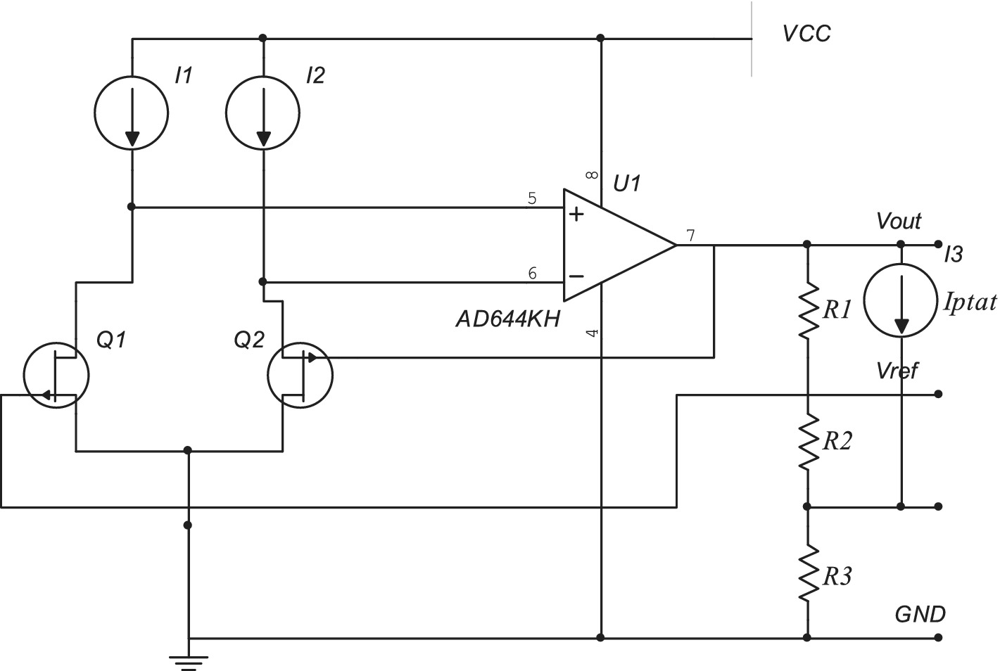
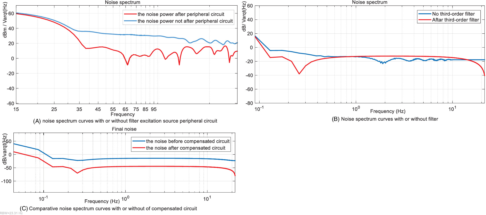
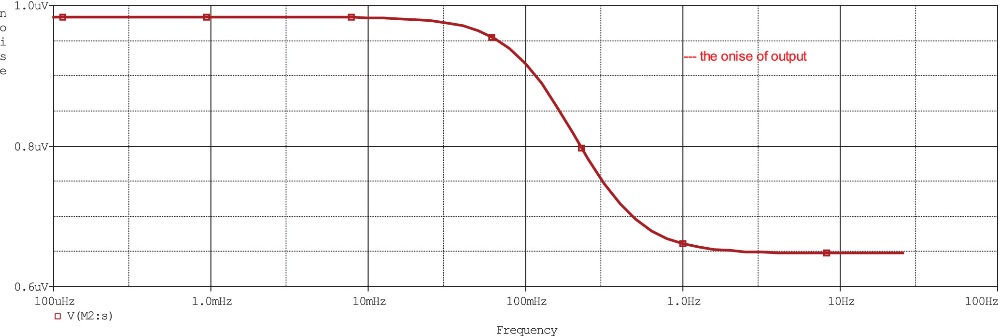

# Reference Voltage Sources Circuit in Lasers

### **[Design and simulation of reference voltage sources circuit in lasers](https://doi.org/10.1002/mop.33143)   [MICROWAVE AND OPTICAL TECHNOLOGY LETTERS](https://onlinelibrary.wiley.com/journal/10982760)  [[bib]](https://github.com/xieyonghao/rvsc)**  
Jiwe Zhang, [Yonghao Xie](https://github.io/xieyonghao), Mingze Yuan, Mingbao Li*   

We proposed a an **improved high-precision voltage source circuit design**. The designed voltage source circuit was improved in **output voltage accuracy, stability, and noise level**, achieving a voltage noise level of 0.978 μV/Hz1/2 at 0.1 mHz at an input voltage of 2V. 

## Introduction
<!-- <p align="center">
  <big><b>Design and simulation of reference voltage sources circuit in lasers (MICROWAVE AND OPTICAL TECHNOLOGY LETTERS 2022)</b></big>
</p>


<p align="center">
  <big><b>Jiawei Zhang,Yonghao Xie,Jianping Huang,Chong Mo,Dawei Mu,Mingbao Li</b></big>
</p> -->

a reference voltage source chip structure was considered.  

<p align="center">
  
</p>

Firstly, a suitable reference voltage source chip is selected, then the excitation source circuit with better stability is designed, a high-order filter is designed for filtering, and finally a compensation circuit is designed to improve the accuracy of the lasers voltage source.

<p align="center">
  
</p>

The designed voltage source circuit was improved in output voltage accuracy, stability, and noise level, achieving a voltage noise level of **0.978 μV/Hz1/2 at 0.1 mHz at an input voltage of 2V**. The validity of the voltage source circuit used for the lasers is verified, providing a high reference value for improving the lasers accuracy in laser spectroscopy. 

<p align="center">
  
</p>


## Citation
```
@inproceedings{J Zhang, MICROWAVE AND OPTICAL TECHNOLOGY LETTERS
  title     = {Design and simulation of reference voltage sources circuit in lasers},
  author    = {Jiawei Zhang,Yonghao Xie,Jianping Huang,Chong Mo,Dawei Mu,Mingbao Li},
  booktitle = {MICROWAVE AND OPTICAL TECHNOLOGY LETTERS},
  year      = {2022}
}
```

## Acknowledgement

This work was supported by the National Key Research and Development Program of China.

## Contact

Yonghao Xie(2020111721@nefu.edu.cn)
